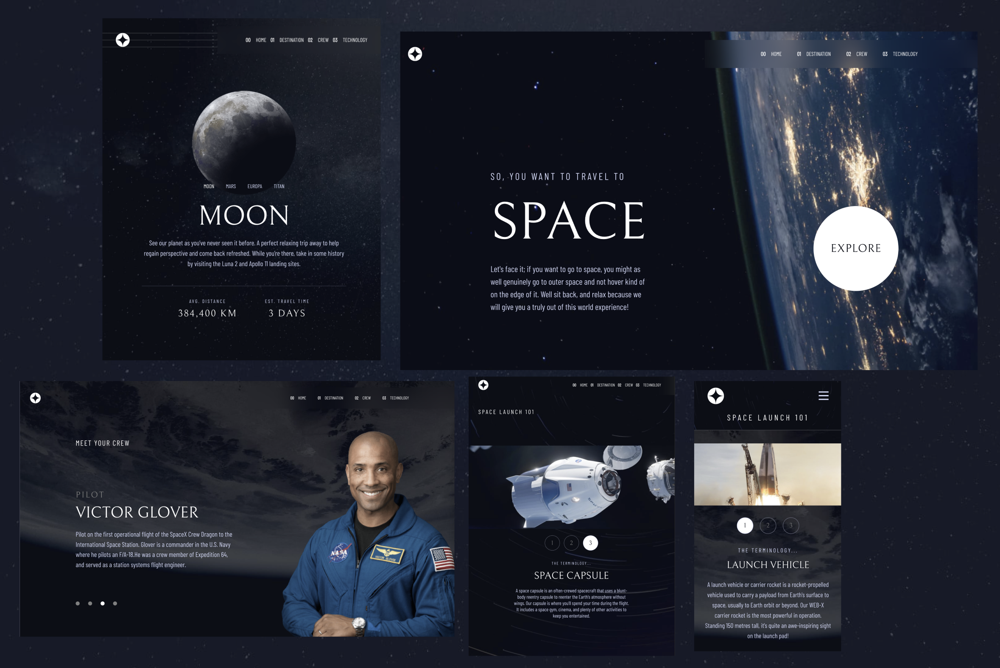

# Space Tourism Website

## Table of contents

- [Overview](#overview)
  - [Screenshot](#screenshot)
  - [Links](#links)
- [Our process](#Our-process)
  - [Built with](#built-with)
  - [What We learned](#what-i-learned)
  - [Continued development](#continued-development)
- [Author](#author)

## Overview

This was a collaborative project between Tom Platt and Joe Walsh. As we both have a passion for space, we decided to build out a space website. The design was taken from a challenge on FrontEnd Mentor. We wanted to see if we could create a like for like design but with our own spin on the functionality and to elevate the static elements into something more interactive.

Overall, we are incredibly happy with how it turned out. It has been challenging but incredibly rewarding and we have learnt a great deal not only in how to develop a multi-page website, but also in how to work as a team and how to organise a larger scale project than we had tackled previously.

### Screenshot

### Links

- Live Site URL: [Add live site URL here](https://your-live-site-url.com)

## Our process

- We employed pair programming and utilised GitHub for seamless collaboration.
- Towards the end of the project, we meticulously tracked issues and used pull requests to refine our codebase.
- Our approach was methodical, perfecting one responsive page at a time.
- Embracing a mobile-first mindset, we ensured a seamless user experience and responsive design across all devices.

### Built with

- Semantic HTML5 markup
- CSS custom properties
- Flexbox
- Mobile-first workflow
- GSAP scroll trigger plugin
- Lenis smooth scroll

### What we learned

- Expanded knowledge of media queries and responsive design.
- Responsive navigation menus across multiple display formats.
- Use of custom CSS elements.
- Semantic HTML elements and aria labels.
- Use of different responsive scroll animations.
- The importance of prior planning when approaching structuring larger projects.

### Continued development

- In the early stages of developing larger projects, it is important to develop a cohesive filing structure. This will be important as we move into more complex front end frameworks that take on a more modular approach.
- Moving forward we can see the value of a CSS preprocessor such as SASS as the CSS files can quickly become convoluted.
- Continue to develop our understanding of more complex animations and utilise tools such as GSAP scroll trigger to their full potential.
- Develop a better understanding of how to achieve optimal loading times whilst still integrating interactive animation elements.
- Develop a reusable workflow when creating and designing elements in order to complete projects more efficiently.

## Authors

Tom Platt

Joe Walsh
